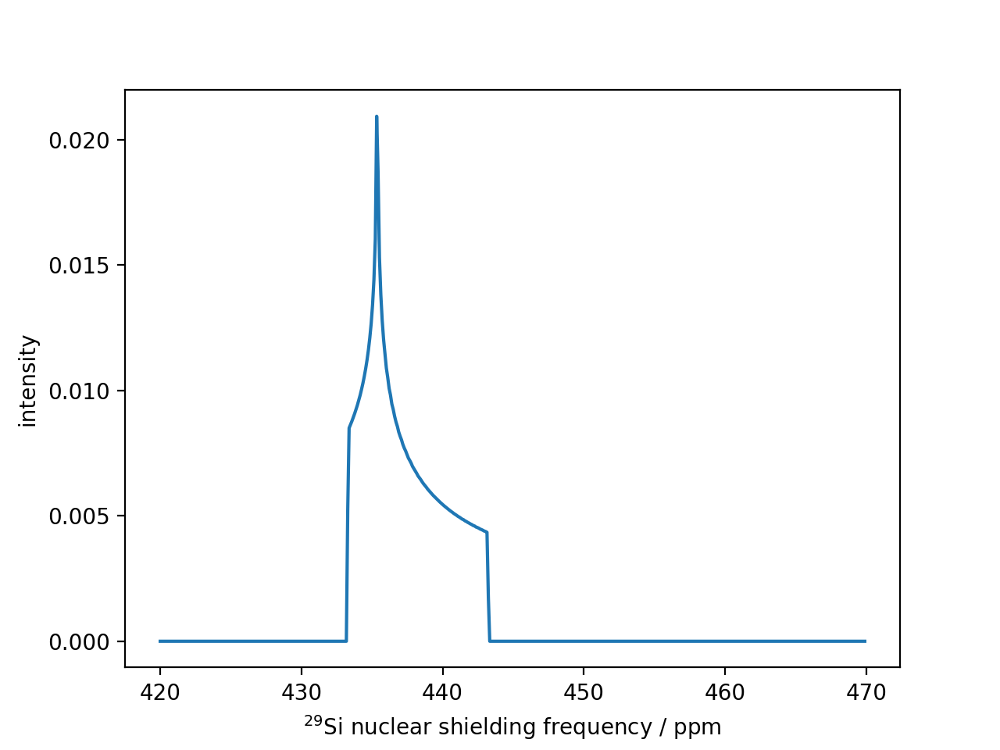

# NMRLineshape

An NMR lineshape/spectrum simulator for python.

The lineshape simulator supports the following:

- Chemical shift anisotropy static spectrum

## Installation

To install the library, first, download the repository and then run the following in the command line.

    python setup.py install

Alternatively, to build the library in the current working directory use

    python setup.py build_ext --inplace

## Run a sample test

    python test_csa_static_lineshape.py

This will print the following

    The method computes a static chemical shielding anisotropy (CSA) NMR
    lineshape spectrum by applying the powder averaging scheme to the CSA
    tensor in the principal axis system (PAS). Note, the CSA tensor is diagonal
    in the PAS with three principal components. The following code uses the
    Haeberlen convention for the principal components.

    The amplitude of the spectrum is evaluated at frequencies which are given by
    ``freq = np.arange(number_of_points)/number_of_points * frequency_bandwidth + start_frequency``

    The code implements the powder averaging scheme by
    Alderman, Solum and Grant, J. Chem. Phys, 84, 1985. DOI: 10.1063/1.450211

    :attr:haeberlen_values: namedtuple: A namedTuple HaeberlenNotation from
                      pymatgen.analysis.nmr
    :attr:number_of_points: int: The number of points in the frequency dimension.
    :attr:start_frequency: float:The starting frequency.
    :attr:frequency_bandwidth float: The spectral width of the frequency spectrum.
    :attr:nt: int: The number of equilateral triangle segments along the edge of
            an octahedron face. A higher number results in better averaging.
            The default  is 48.

        :returns:freq: A ``Numpy array`` of frequencies.
        :returns:amp: A ``Numpy array`` of amplitudes corresponding to the frequencies.

and render a plot (matplotlib is required for the plot).

See also

[Jupyter notebook file](./test_csa_static_lineshape.ipynb)
